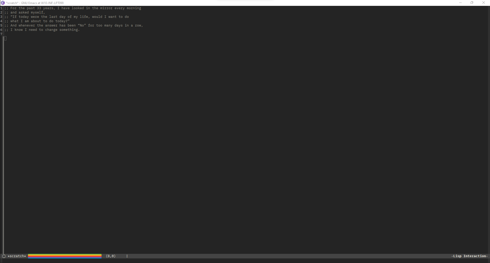
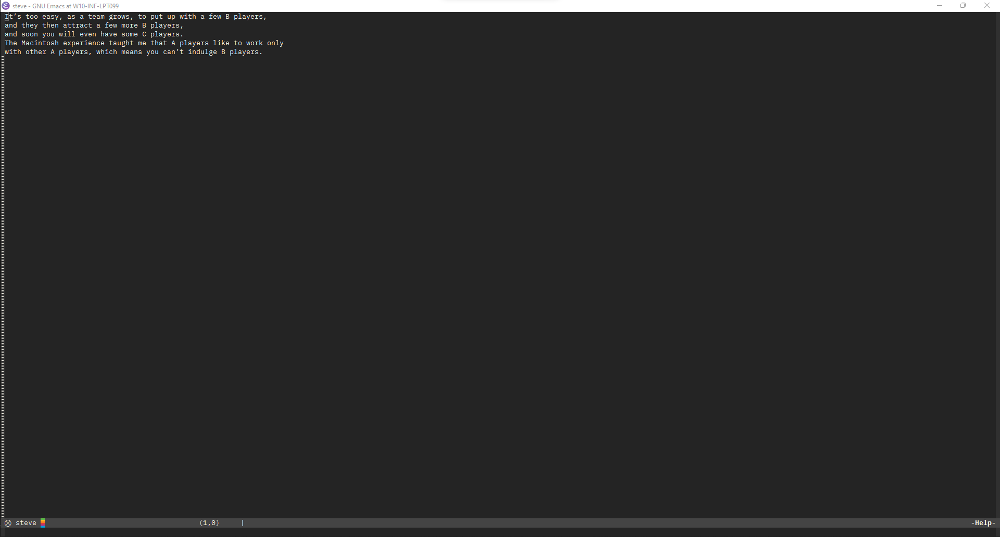

# steve

This package is a tribute to Steve Jobs, one of the world's greatest minds ever.

Let Emacs welcomes you with a random Steve Jobs quote as the default message for your 
`*scratch*` buffer each run or ask for a random quote whenever you want.

## Installation

As of today, this package is not available on MELPA or other repository, so you can 
install it manually or by using `straight` and pointing directly to this github repository
like this: 

``` elisp
(setq use-steve-quote-as-scratch-buffer-initial-message t)

(straight-use-package
 '(steve :type git :host github :repo "mastro35/steve" :files ("steve.el")))
(steve-init)
```

## Usage

Setting the `use-steve-quote-as-scratch-buffer-initial-message` variable before invoking 
the `(steve-init)` function you can set the initial message to the `*scratch*` buffer 
with a randomic Steve's quote. 



And if you need an extra quote after Emacs is started, you just need to call the `steve` 
function with `M-x steve`.



## Contributions

Contributions are precious, if you know some other quotes that are not present in this 
archive and you want me to add it, just mail me at `mastro35@gmail.com` or open a pull 
request linking also the source of the missing quote you found.
